# Legacy System ERD

> **Note:** Reverse-engineered from the production database.  
> Do not modify without verifying against the actual schema.

## Overview

This diagram represents the entity-relationship model of the legacy system, covering the following domains:

- **Parties** — issuers, customers, suppliers, salespersons, addresses and contacts
- **Product catalog** — products, grid (size/color variants), brands, categories and taxes
- **Inventory** — stock movements and stock recounts
- **Sales** — sales, items, exchanges, due dates and consignments
- **Store credit** — store credit notes and items
- **Returns** — return documents, items and notes
- **Purchasing** — purchases, accounts payable and payments
- **Receivables** — receivable bills and payments
- **Cash register** — cash register entries

---

## Diagram

```mermaid
erDiagram
    ISSUER {
        Integer id PK
        String cnpj
        String cpf
        String companyName
        String tradeName
        Enum personType
        boolean customer
        boolean supplier
        boolean salesperson
        BigDecimal commissionPercent
        BigDecimal baseSalary
    }
    ADDRESS {
        Integer id PK
        String street
        String neighborhood
        String zipCode
        String number
        String complement
    }
    CONTACT {
        Integer id PK
        String description
        Enum classification
    }
    CITY {
        Integer id PK
        Integer ibgeCityCode
        String cityName
        String stateName
        String stateAbbr
    }
    COMPANY {
        Integer id PK
        String cnpj
        String companyName
        String tradeName
        String street
        String phone
    }
    USER {
        String login PK
        String password
        String name
    }
    PRODUCT {
        Integer id PK
        String description
        BigDecimal price
        BigDecimal cost
        Date purchaseDate
    }
    PRODUCTGRID {
        Integer id PK
        String barcode
        int implantationQty
    }
    SIZE {
        Integer id PK
        String description
    }
    COLOR {
        Integer id PK
        String description
    }
    BRAND {
        Integer id PK
        String description
    }
    PRODUCTCATEGORY {
        Integer id PK
        String description
        String ncmCode
    }
    TAX {
        Integer id PK
        String description
        BigDecimal municipalRate
        BigDecimal stateRate
        BigDecimal federalRate
        Enum icms
        Enum pis
        Enum cofins
    }
    INVENTORY {
        Integer id PK
        Date date
        boolean inbound
        boolean outbound
        int quantity
        Enum operation
        String history
    }
    STOCKRECOUNT {
        Integer id PK
        Date date
        String notes
    }
    STOCKRECOUNTITEM {
        Integer id PK
    }
    SALE {
        int id PK
        Date date
        int quantity
        BigDecimal totalValue
        BigDecimal grossTotalValue
        BigDecimal discountPercent
        Enum cfop
        int installments
    }
    SALEITEM {
        Integer id PK
        int quantity
        BigDecimal unitPrice
        BigDecimal totalValue
        BigDecimal stateTax
        BigDecimal federalTax
    }
    EXCHANGEITEM {
        Integer id PK
        int quantity
        Date date
    }
    SALEDUEDATE {
        int id PK
        Date dueDate
        BigDecimal value
        Enum paymentMethod
    }
    CONSIGNMENT {
        Integer id PK
        Date date
        Integer outboundQty
        BigDecimal outboundTotal
        Integer inboundQty
        BigDecimal inboundTotal
    }
    CONSIGNMENTITEM {
        int id PK
        int quantity
        Date date
        boolean sold
    }
    STORECREDIT {
        int id PK
        Date date
        int quantity
        BigDecimal totalValue
    }
    STORECREDITITEM {
        int id PK
        int quantity
        Date date
    }
    RETURN {
        int id PK
        String companyName
        String cnpj
        BigDecimal totalValue
        int totalQuantity
        Enum cfop
        Enum modality
    }
    RETURNITEM {
        int id PK
        String description
        String ncmCode
        int quantity
        BigDecimal unitValue
        BigDecimal totalValue
        BigDecimal icmsPercent
    }
    RETURNNOTE {
        int id PK
        String note
    }
    PURCHASE {
        int id PK
        Date date
        BigDecimal totalValue
        String notes
        String invoiceNumber
    }
    ACCOUNTPAYABLE {
        int id PK
        Date dueDate
        BigDecimal value
        Enum expectedMethod
        String notes
    }
    ACCOUNTPAYABLETYPE {
        int id PK
        String description
    }
    BANKACCOUNT {
        int id PK
        String description
        Enum type
        Enum bank
        String accountNumber
    }
    ACCOUNTPAYABLEPAYMENT {
        int id PK
        Date date
        BigDecimal value
        Enum paymentMethod
    }
    CASHACCOUNT {
        int id PK
        String description
    }
    CASHREGISTER {
        int id PK
        Date date
        BigDecimal value
        Enum type
        Enum method
        String description
    }
    RECEIVABLE {
        int id PK
        int number
        Date issueDate
        Date dueDate
        BigDecimal value
        BigDecimal balance
        BigDecimal paymentsTotal
    }
    RECEIVABLEPAYMENT {
        int id PK
        Date date
        BigDecimal value
    }
    COMMISSIONBONUS {
        int id PK
        BigDecimal rangeStart
        BigDecimal rangeEnd
        BigDecimal bonusValue
    }
    FISCALRETURN {
        Integer id PK
        String key
        LocalDateTime issueDate
        String totalValue
        Integer saleId
        String returnCode
    }
    TOKEN {
        String id PK
        String type
        LocalDateTime dateGenerated
        LocalDateTime dateExpires
        Integer availableAmount
    }

    %% Location
    ISSUER ||--o{ ADDRESS : "addresses"
    ISSUER ||--o{ CONTACT : "contacts"
    ADDRESS }o--|| CITY : "city"
    COMPANY }o--|| CITY : "city"

    %% Product catalog
    PRODUCT }o--|| COLOR : "color"
    PRODUCT }o--|| PRODUCTCATEGORY : "category"
    PRODUCT }o--|| BRAND : "brand"
    PRODUCT }o--|| TAX : "tax"
    PRODUCT ||--o{ PRODUCTGRID : "sizes"
    PRODUCTGRID }o--|| SIZE : "size"

    %% Inventory
    INVENTORY }o--|| PRODUCTGRID : "product"
    STOCKRECOUNT ||--o{ STOCKRECOUNTITEM : "items"
    STOCKRECOUNTITEM }o--|| PRODUCTGRID : "product"

    %% Sales
    SALE }o--|| ISSUER : "customer"
    SALE }o--o| ISSUER : "salesperson"
    SALE ||--o{ SALEITEM : "items"
    SALE ||--o{ SALEDUEDATE : "dueDates"
    SALE ||--o{ EXCHANGEITEM : "exchanges"
    SALEITEM }o--|| PRODUCTGRID : "product"
    SALEITEM }o--|| INVENTORY : "inventory"
    EXCHANGEITEM }o--|| PRODUCTGRID : "product"
    EXCHANGEITEM }o--|| INVENTORY : "inventory"
    SALEDUEDATE }o--o| RECEIVABLE : "receivable"

    %% Consignment
    CONSIGNMENT }o--|| ISSUER : "customer"
    CONSIGNMENT }o--o| ISSUER : "salesperson"
    CONSIGNMENT ||--o{ CONSIGNMENTITEM : "items"
    CONSIGNMENTITEM }o--|| PRODUCTGRID : "product"
    CONSIGNMENTITEM }o--|| INVENTORY : "inventory"

    %% Store credit
    STORECREDIT }o--|| ISSUER : "customer"
    STORECREDIT ||--o{ STORECREDITITEM : "items"
    STORECREDITITEM }o--|| PRODUCTGRID : "product"
    STORECREDITITEM }o--|| INVENTORY : "inventory"

    %% Returns
    RETURN ||--o{ RETURNITEM : "items"
    RETURN ||--o{ RETURNNOTE : "notes"

    %% Purchases / accounts payable
    PURCHASE }o--|| ISSUER : "supplier"
    PURCHASE ||--o{ ACCOUNTPAYABLE : "dueDates"
    ACCOUNTPAYABLE }o--|| ACCOUNTPAYABLETYPE : "type"
    ACCOUNTPAYABLE }o--|| ISSUER : "supplier"
    ACCOUNTPAYABLE }o--|| BANKACCOUNT : "account"
    ACCOUNTPAYABLE ||--o{ ACCOUNTPAYABLEPAYMENT : "payments"

    %% Receivables
    RECEIVABLE }o--|| ISSUER : "issuer"
    RECEIVABLE ||--o{ RECEIVABLEPAYMENT : "payments"

    %% Cash register
    CASHREGISTER }o--|| CASHACCOUNT : "account"
    CASHREGISTER }o--|| ISSUER : "issuer"
```

